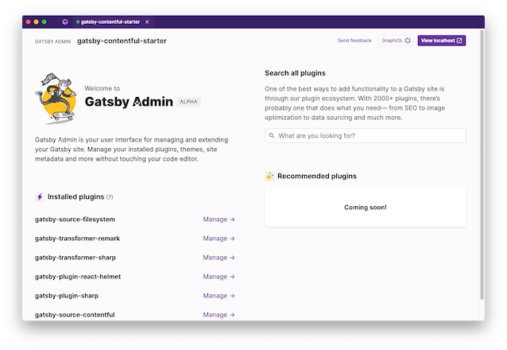
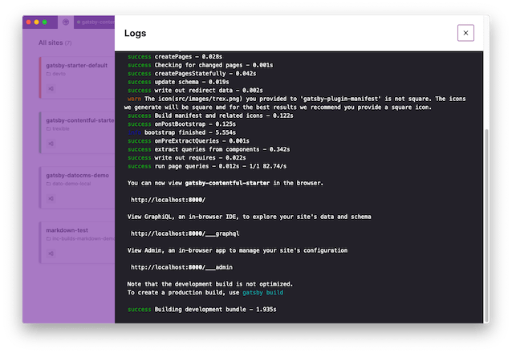

# Gatsby Desktop

A proof-of-concept desktop app for managing your Gatsby sites.

- [Installation](#installation)
  - [Installing built packages](#installing-built-packages)
  - [Installing from source](#installing-from-source)
- [Screenshots](#screenshots)
- [Architecture](#architecture)
- [Development](#development)
  - [Release process](#release-process)

## Installation

:warning: Warning: This is alpha software, which means it is not expected to be stable. Please [report bugs and share your feedback](https://github.com/gatsbyjs/desktop/issues)

### Installing built packages

1. Click on [releases](https://github.com/gatsbyjs/desktop/releases/latest) and choose the installer for your platform.

### Installing from source

1. Clone the repo
2. Run `yarn`
3. `yarn develop`

## Screenshots

## Architecture

Gatsby Desktop is an Electron app. All Electron apps have two primary processes:

1. "main", which is a Node.js script which handles windowing, menus and similar native bits. Think of it as the server. It opens `BrowserWindow`s which contain:
2. "renderer": this is the UI of the app, which is HTML + JS. In Gatsby Desktop, this is of course a local Gatsby site. Unlike a regular web app, Electron renderers can import and use built-in Node.js modules, such as `fs` and `child_process`.

Gatsby Desktop can launch and run your local Gatsby sites. We spawn these in the main process, which maintains a list of running site. The renderer gets this list over IPC and stores it in React context. There are React hooks to make it easy to access the list of sites and whether or not they're running. The main process also auto-discovers any local Gatsby sites and watches these for changes.

## Development

Gatsby Desktop is written in TypeScript. We use [microbundle](https://github.com/developit/microbundle) to compile and bundle the worker and main scripts. The renderer is a Gatsby site, which we run with `gatsby develop` during development, or SSR in production and serve from a local Express static server. `yarn develop` compiles and runs everything. It uses `gatsby develop`, so you have hot reloading, but bear in mind that this doesn't clean up the child processes properly, so if those are running you'll need to restart the process. It also watches and compiles the worker and main bundles.

To debug the renderer, use [Chrome devtools](chrome://inspect/#devices) and listen to port 8315.

## Telemetry

If you opt-in to telemetry, the app sends anonymous information about how use it. This is mainly checking which features you use and how much you use them. This helps us prioritize which features to develop, and to improve the app. This is particularly important as it is a proof-of-concept. This is entirely optional though, so if you don't opt-in we don't track anything except the fact that you have opted-out. All other events are not sent. This setting is separate from the telemetry setting for Gatsby itself. You can see more details on telemetry in Gatsby at https://gatsby.dev/telemetry

### Release process

Create a draft release in GitHub, with the tag as the new version number prefixed with `v`, e.g. `v0.0.1-alpha.2`. Update the version number in package.json to match, and commit. Push that to master and GitHub Actions should do a build and eventually attach the packaged files to the draft release. Once the build is complete, publish the draft release.
