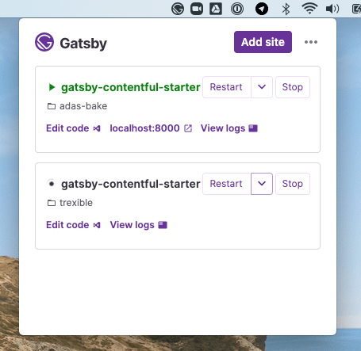

# Gatsby Desktop

A proof-of-concept desktop app for managing your Gatsby sites.

## Warning

This is alpha software, is under active development, and is likely to be broken. Use at your own risk.

### To install built packages:

1. Click on releases and choose the installer for your platform. Mac users will need to right-click (or ctrl-click) on the app when you first launch it, until we have code signing set up.

### To install from source:

1. Clone the repo
2. Run `yarn`
3. `yarn develop`

## Architecture

Gatsby Desktop is an Electron app, which is currently just displayed in the menubar or tray. All Electron apps have two primary processes:

1. "main", which is a Node.js script which handles windowing, menus and similar native bits. Think of it as the server. It opens BrowserWindows which contain:
2. "renderer": this is the UI of the app, which is HTML + JS. In Gatsby Desktop, this is of course a local Gatsby site. Unlike a regular web app, Electron renderers can import and use built-in Node.js modules, such as `fs` and `child_process`.

Gatsby Desktop can launch and run your local Gatsby sites. To do this we use another process:

3. The "worker". This is a [Web Worker](https://developer.mozilla.org/en-US/docs/Web/API/Web_Workers_API/Using_web_workers). One of these is spawned by the renderer for each Gatsby site launched be the app. These workers then spawn the actual Node `ChildProcess` that runs the site. As well as invoking `gatsby develop` for the site, the worker also takes care of logging and killing and restarting the process as needed. When it is running, it opens an IPC channel to the child process, through which it receives structured logs. It then forwards these logs to the renderer using `postMessage`.

## Development

Gatsby Desktop is written in TypeScript. We use [microbundle](https://github.com/developit/microbundle) to compile and bundle the worker and main scripts. The renderer is a Gatsby site, which we run with `gatsby develop` during development, or SSR in production and serve from a local Express static server. `yarn develop` compiles and runs everything. It uses `gatsby develop`, so you have hot reloading, but bear in mind that this doesn't clean up the child processes properly, so if those are running you'll need to restart the process. It also watches and compiles the worker and main bundles.

To debug the renderer, use [Chrome devtools](chrome://inspect/#devices) and listen to port 8315.

### Release process

Great a draft release in GitHub, with the tag as the new version number prefixed with `v`, e.g. `v0.0.1-alpha.2`. Update the version number in package.json to match, and commit. Push that to master and GitHub Actions should do a build and eventually attach the packaged files to the draft release. Once the build is complete, publish the draft release.
